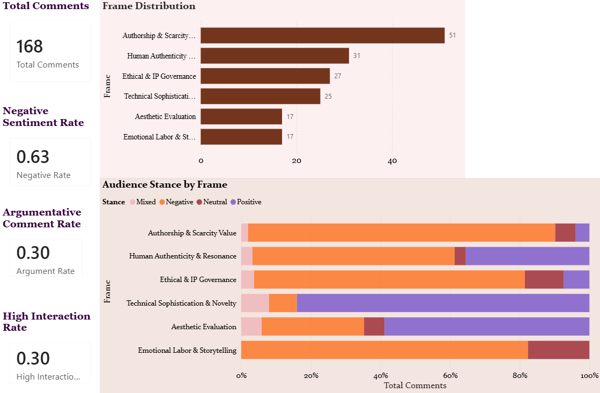
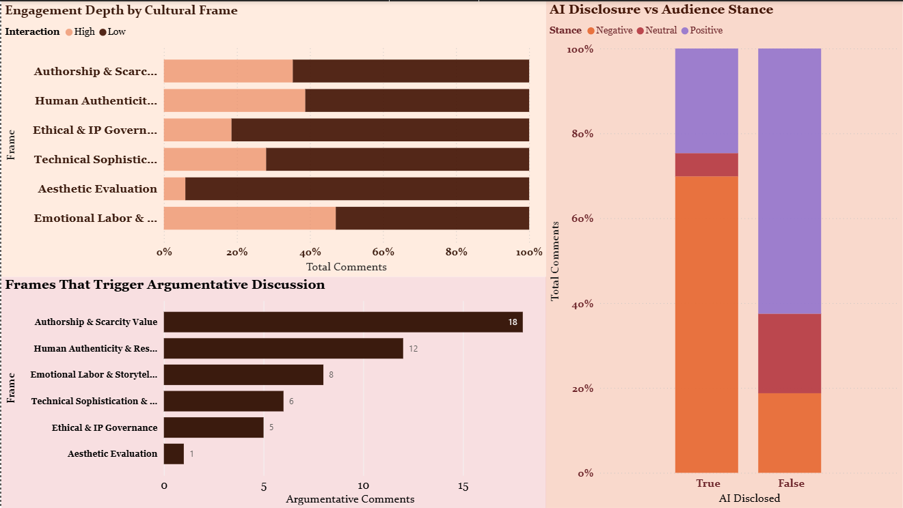

# When Authorship Becomes Ambiguous: Decoding Public Perception and the Evolution of Cultural Value in the Age of AI
This project explores how audiences interpret AI-generated artworks and how questions of authorship influence cultural perception and value signals.

The analysis combines Python and SQL to examine discourse patterns, governance rules, and engagement outcomes related to AI-generated art.

## Methods
SQL-based discourse analysis and Python engagement modeling

---

# Datasets

This project integrates **three datasets** to analyze governance rules, audience discourse, and market engagement signals related to AI-generated art.

---

## Dataset 1 — AI Rules Subreddit Dataset

This dataset contains metadata and moderation rules from English-language subreddits that explicitly reference AI-generated content. The dataset was collected in November 2024 and labeled according to community governance categories described in the original research paper.

### Dataset Schema

| Column | Type | Description |
|------|------|-------------|
| id | string | Unique identifier for each subreddit |
| name | string | Name of the subreddit |
| public_description | string | Public description of the subreddit |
| subscribers | integer | Number of subscribers |
| rules | json_object | Raw rules data of the subreddit |
| cleaned_rules | string | Processed rules text |
| created_utc | timestamp | Unix timestamp when the subreddit was created |
| topic_label | string | Topic classification of the subreddit |
| has_ai_rule_label | boolean | Indicates whether the subreddit has rules related to AI-generated content |
| is_topical_question_and_answer_ca_label | boolean | Community archetype classification |
| is_learning_and_perspective_broadening_ca_label | boolean | Community archetype classification |
| is_social_support_ca_label | boolean | Community archetype classification |
| is_content_generation_ca_label | boolean | Community archetype classification |
| is_affiliation_with_an_entity_ca_label | boolean | Community archetype classification |

Source:  
Lloyd, T., Gosciak, J., Nguyen, T., & Naaman, M. (2025).  
   *AI Rules? Characterizing Reddit Community Policies Towards AI-Generated Content.*  

---

## Dataset 2 — Audience Discourse Dataset

This dataset contains **manually coded audience comments** discussing AI-generated artworks across social media platforms (Instagram and Threads).  
Several analytical variables were derived during preprocessing to support discourse analysis.

### Dataset Schema

| Column Name | Data Type | Description |
|-------------|-----------|-------------|
| ai_disclosed | Boolean | Indicates whether the original post explicitly disclosed the use of AI in generating the artwork |
| comment_text | Text | Raw text of the user comment |
| stance_manual | Categorical | Manual annotation of audience stance toward AI-generated artwork (Positive, Negative, Neutral) |
| frame_manual | Categorical | Manual classification of the interpretive frame using a **6-class cultural framing taxonomy** |
| words_count | Integer | Number of words in the comment, used as a proxy for engagement intensity |
| argument_marker | Boolean | Indicates whether the comment contains argumentative language markers (e.g., because, should, but) |
| interaction_depth | Categorical | Derived engagement level based on linguistic indicators (High / Low interaction depth) |

---

## Dataset 3 — AI-Generated Art Popularity and Market Trends (External Dataset)

This project incorporates an external dataset containing engagement and pricing indicators for AI-generated artworks.

The dataset includes variables such as artwork pricing, engagement metrics, and creator attributes, which are used to explore relationships between creator type, engagement rate, and market signals.

Source:  
Atharva Soundankar. *AI Generated Art Popularity and Market Trends.*  
Kaggle Dataset.  

---

## Analytical Workflow

Methods used in this project include:

- SQL-based discourse analysis
- Python engagement modeling
- manual discourse coding
- data storytelling through Power BI

The analytical pipeline follows these steps:

1. Data preparation and cleaning  
2. Data validation and sanity checks  
3. SQL-based discourse analysis  
4. Python-based engagement and price analysis  
5. Strategic interpretation  
6. Power BI storytelling dashboard

---

## Data Visualization & Storytelling

### Page 1 — Audience Discourse Overview

This page summarizes:

- Cultural frame distribution
- Audience stance toward AI-generated artworks
- Overall sentiment indicators

### Page 2 — Engagement Drivers

This page examines deeper engagement dynamics:

- Interaction depth across cultural frames
- Argumentative engagement patterns
- Audience reactions to AI disclosure

The Power BI dashboard file (`ai_art_discourse_dashboard.pbix`) is included in the repository.

---

## Key Insights & Strategic Implications

This analysis highlights how audience discourse shapes the perceived value of AI-generated art. Several strategic implications emerge for platforms, cultural institutions, and creators.

1. Human-in-the-Loop Narratives Matter

Audience engagement increases when AI artworks are framed as part of a human creative process rather than fully automated generation.

Implication:
Platforms and creators should emphasize AI-augmented creativity, documenting prompt iterations, artistic decisions, and editing processes.

2. Disclosure Requires Nuance

Binary labels such as “AI-generated” can trigger an authorship discount, where audiences devalue artworks once AI involvement is revealed.

Implication:
Platforms may benefit from graduated disclosure systems (e.g., AI-assisted, human-directed, hybrid creation) instead of simple yes/no labeling.

3. Creative Provenance Builds Trust

Audience skepticism often arises from uncertainty about how an artwork was produced.

Implication:
Platforms could introduce creative provenance systems that document the artistic process, including prompt evolution, editing stages, and creative timelines.

4. Protecting Human Creators Remains Critical

Public discourse frequently frames AI art as a threat to human creative labor.

Implication:
Platform governance mechanisms such as creator compensation models, dataset licensing, or visibility prioritization may help sustain creative ecosystems.

5. AI Art Literacy Can Improve Cultural Dialogue

Many audience reactions reflect limited understanding of how AI-assisted creativity works.

Implication:
Museums, platforms, and creators can promote AI literacy initiatives through exhibitions, creator commentary, and educational storytelling.

6. Human Craft May Become a Scarcity Premium

As AI-generated imagery becomes abundant, human-made artworks may gain value through perceived rarity and authenticity.

Implication:
Art institutions and marketplaces may explore “human-crafted” certifications or curated collections emphasizing manual creativity.

---

# Technologies Used

- Python (Pandas)
- SQL (DuckDB)
- Jupyter Notebook
- Power BI

---

## Data Sources

This project uses publicly available datasets:

1. **AI Rules Subreddit Dataset**  
   Lloyd, T., Gosciak, J., Nguyen, T., & Naaman, M. (2025).  
   *AI Rules? Characterizing Reddit Community Policies Towards AI-Generated Content.*  
   Proceedings of the CHI Conference on Human Factors in Computing Systems.  
  Paper:
  https://doi.org/10.1145/3706598.3713292

  Dataset:
  https://github.com/sTechLab/AIRules/tree/main/ai_rules_subreddit_set

2. **AI-Generated Art Popularity and Market Trends Dataset**  
   Soundankar, A. (Kaggle Dataset).  
   https://www.kaggle.com/datasets/atharvasoundankar/ai-generated-art-popularity-and-market-trends

---

## Repository Structure

AI-Art-Discourse-Analysis
│
├── notebooks
│   └── ai_art_discourse_analysis.ipynb
│
├── dashboards
│   └── ai_art_discourse_dashboard.pbix
│
├── dashboard_screenshots
│   ├── dashboard_overview.png
│   └── dashboard_engagement.png
│
├── datasets
│   └── Audience_discourse.xlsx
│
└── README.md
