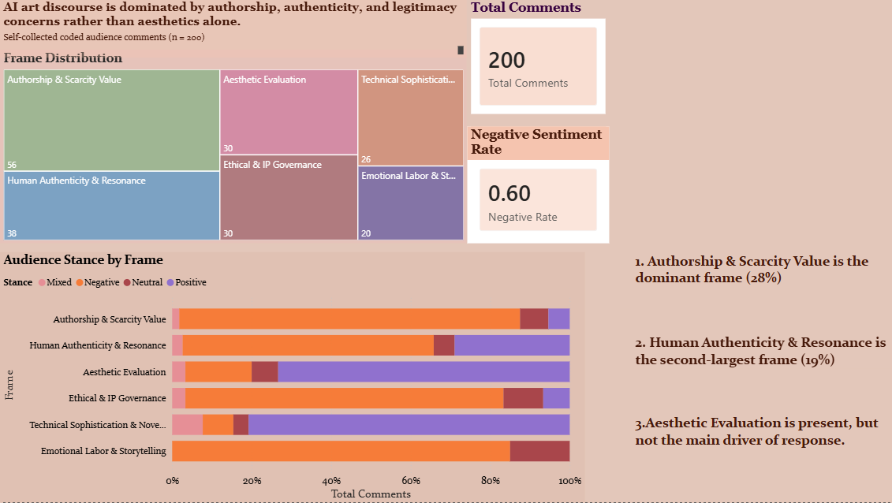

# When Authorship Becomes Ambiguous: Decoding Public Perception and the Evolution of Cultural Value in the Age of AI

This project examines how AI-assisted artworks are evaluated across three connected but not fully aligned layers of the contemporary AI art ecosystem:

- `Governance Layer`: how online communities regulate AI-generated content
- `Audience Discourse Layer`: how audiences interpret authorship, authenticity, disclosure, and cultural value
- `Market Signal Layer`: whether external price and engagement indicators show similar differentiation across creator types

The core argument is that AI art value is not produced in a single space. It is co-constructed through governance rules, public discourse, and platform-facing market signals, and these layers do not always move in the same direction.

## Methods

- rule-based governance classification on subreddit rules
- manual coding of audience comments
- Python and DuckDB analysis for descriptive and cross-tab results
- external market-signal comparison using Kaggle data
- Power BI storytelling

---

## Datasets

### Dataset 1 - AI Rules Subreddit Dataset

This dataset contains subreddit metadata and moderation rules from English-language Reddit communities that reference AI-generated content.

It is used for the `Governance Layer`, where rule text is classified into governance variables such as:

- `mentions_ai`
- `ai_ban`
- `ai_label`
- `ai_quality`
- `ai_policy_mix`
- `ai_stance`

#### Dataset Schema

| Column | Type | Description |
|------|------|-------------|
| id | string | Unique identifier for each subreddit |
| name | string | Name of the subreddit |
| public_description | string | Public description of the subreddit |
| subscribers | integer | Number of subscribers |
| rules | json_object | Raw rules data of the subreddit |
| cleaned_rules | string | Processed rules text |
| created_utc | timestamp | Unix timestamp when the subreddit was created |
| topic_label | string | Topic classification of the subreddit |
| has_ai_rule_label | boolean | Indicates whether the subreddit has rules related to AI-generated content |
| is_topical_question_and_answer_ca_label | boolean | Community archetype classification |
| is_learning_and_perspective_broadening_ca_label | boolean | Community archetype classification |
| is_social_support_ca_label | boolean | Community archetype classification |
| is_content_generation_ca_label | boolean | Community archetype classification |
| is_affiliation_with_an_entity_ca_label | boolean | Community archetype classification |

### Dataset 2 - Audience Discourse Dataset

This dataset contains manually coded audience comments about AI-generated artworks collected from social platforms such as Instagram and Threads.

It is used for the `Audience Discourse Layer`, where each comment is analyzed through:

- `frame_manual`
- `stance_manual`
- `ai_disclosed`
- derived variables such as `word_count`, `argument_marker`, and `interaction_depth`

To reduce ad hoc selection bias, data collection followed a consistent rule-based approach focused on top posts and top comments within the defined collection window. This improves consistency, but it does not eliminate bias. It likely introduces `popularity bias`, and the dataset should be treated as a structured qualitative-quantitative sample rather than a representative population sample.

#### Dataset Schema

| Column Name | Data Type | Description |
|-------------|-----------|-------------|
| ai_disclosed | Boolean | Indicates whether the original post explicitly disclosed the use of AI |
| comment_text | Text | Raw text of the user comment |
| stance_manual | Categorical | Manual annotation of audience stance toward AI-generated artwork |
| frame_manual | Categorical | Manual classification of the interpretive frame using a 6-class cultural framing taxonomy |
| word_count | Integer | Derived number of words in the comment |
| argument_marker | Categorical | Derived indicator of argumentative language markers |
| interaction_depth | Categorical | Derived engagement level based on linguistic indicators |

### Dataset 3 - AI-Generated Art Popularity and Market Trends Dataset

This external dataset contains artwork pricing, engagement metrics, creator labels, and platform-facing metadata.

It is used for the `Market Signal Layer` as `external contextual evidence`, not as a direct validation dataset for the discourse coding scheme. Its role is to provide a contrast layer: if authorship conflict is strong in discourse, do platform-facing price and engagement indicators also show strong differentiation?

#### Dataset Schema

| Column Name | Data Type | Description |
|-------------|-----------|-------------|
| Artwork_ID | Integer | Unique identifier for each artwork |
| Platform | Text | Platform where the artwork was posted or listed |
| Style | Text | Artwork style category |
| Creator_Type | Categorical | Creator category such as AI, hybrid, or individual |
| Views | Integer | Number of views |
| Likes | Integer | Number of likes or reactions |
| Shares | Integer | Number of shares |
| Comments | Integer | Number of comments |
| Price (USD) | Float | Listed price of the artwork in USD |
| Engagement_Score | Float | Platform-provided engagement metric from the source dataset |

---

## Three-Layer Analytical Workflow

### Layer 1 - Governance

This layer asks how communities regulate AI-generated content before audiences even respond to it.

Using the AI Rules Subreddit Dataset, the notebook classifies governance patterns into ban-oriented, label-oriented, quality-control, and mixed policy forms. The purpose of this layer is to identify how AI art enters public cultural space through moderation rules and institutional boundaries.

### Layer 2 - Audience Discourse

This layer asks how audiences interpret AI authorship once they encounter AI-assisted artworks.

Using the self-collected coded comment dataset, the notebook analyzes:

- cultural framing
- audience stance
- interaction depth
- disclosure as a discourse variable

The purpose of this layer is to show that public response is shaped less by visual quality alone and more by questions of authorship, legitimacy, labor, authenticity, and value.

### Layer 3 - Market Signals

This layer asks whether those cultural tensions are also visible in external price and engagement indicators.

Using the Kaggle dataset, the notebook compares creator types across price and cleaned engagement metrics. This layer is intentionally descriptive and contextual. Because the dataset is external and not designed around the same interpretive variables as the discourse dataset, it should be read as supplementary evidence rather than direct proof.

---

## Key Findings

The findings below reflect current notebook outputs from `authorship_ambiguity_analysis.ipynb`.

### 1. Governance is more often restrictive than disclosure-based

- In the governance dataset (`n = 4251`), `Ban / Prohibited` was the largest explicit governance stance (`1834` communities).
- `AI mentioned / stance unclear` appeared in `1667` communities, suggesting many communities acknowledge AI without specifying a stable governance model.
- `Quality Control` appeared in `452` communities.
- `Regulated / Label Required` appeared in only `120` communities.
- The most common policy mix was `ban + quality` (`572` communities, `13.5%` of in-scope cases).

Interpretation: AI governance is more often structured through exclusion and quality control than through transparent disclosure frameworks alone.

### 2. Audience discourse is legitimacy-centered and mostly negative

- In the self-collected discourse dataset (`n = 200`), stance distribution was `60.0% Negative`, `29.5% Positive`, `7.5% Neutral`, and `3.0% Mixed`.
- The most common frame was `Authorship & Scarcity Value` (`56` comments, `28.0%`).
- The next largest frame was `Human Authenticity & Resonance` (`38` comments, `19.0%`).
- Only `11%` of comments were coded as `High` interaction depth.

Interpretation: audience response is driven primarily by authorship, legitimacy, and authenticity concerns rather than by purely aesthetic evaluation.

### 3. Disclosure patterns are suggestive, but still exploratory

- In the current sample, non-disclosed cases remain much smaller (`No = 26`, `Yes = 174`).
- Non-disclosed comments were mostly `Positive` within that smaller group (`76.92%`).
- Disclosed comments were mostly `Negative` (`67.24%`).
- The relationship between disclosure and interaction depth was not statistically significant (`chi-square = 2.515`, `p = 0.113`).

Interpretation: the notebook supports descriptive disclosure-related differences within this sample, but it does not justify a causal claim that disclosure itself produces backlash or deeper engagement.

### 4. External market signals remain comparatively undifferentiated

- In the external market dataset (`n = 5000`), median prices were similar across creator types:
  - `AI Model = 2436.95 USD`
  - `Hybrid = 2541.91 USD`
  - `Individual = 2456.24 USD`
- Median cleaned engagement rates were also very close:
  - `AI Model = 0.3247`
  - `Hybrid = 0.3354`
  - `Individual = 0.3342`

Interpretation: the strong authorship tensions visible in discourse do not clearly translate into sharply differentiated market-facing signals in this external dataset.

---

## Methodological Notes And Limitations

### Self-Collected Audience Data

- The audience dataset uses a consistent top-post and top-comment collection rule to reduce arbitrary selection.
- This improves reproducibility, but it may overrepresent highly visible or highly reactive discussions.
- Disclosure groups are imbalanced (`No = 26`, `Yes = 174`), so disclosure comparisons should remain exploratory.
- The dataset is well suited to identifying dominant discourse patterns, but less suited to strong causal inference.

### External Market Dataset

- The Kaggle dataset is not designed around the same coding logic as the discourse dataset.
- It should therefore be treated as `external contextual evidence` rather than a direct validation layer.
- Its relatively even distributions across creator types weaken any claim that AI authorship already produces clear platform-level price or engagement penalties.
- This is analytically useful: it suggests that `symbolic conflict` and `market signal differentiation` may not yet be aligned.

---

## Strategic Recommendations

These recommendations are intended as `interpretive and sustainability-oriented implications`, not as direct effects proved by the data.

The most evidence-aligned recommendations in the current notebook are:

- stronger human process framing
- layered disclosure rather than binary labels
- provenance and process transparency systems

More ambitious proposals, such as revenue safeguards or human-made scarcity positioning, should be framed as strategic extensions rather than as conclusions directly demonstrated by the market layer.

---

## Power BI Storytelling

### Page 1 - Audience Discourse Overview



This page summarizes:

- cultural frame distribution
- audience stance
- discourse-level sentiment patterns

### Page 2 - Engagement Drivers


This page examines:

- interaction depth by frame
- argumentative engagement patterns
- disclosure-related audience reactions

The Power BI dashboard file `ai_art_discourse_dashboard.pbix` is included in the repository.

---

## Technologies Used

- Python
- Pandas
- Matplotlib
- Seaborn
- SciPy
- DuckDB
- Jupyter Notebook
- Power BI

---

## Data Sources

This project uses publicly available datasets:

### AI Rules Subreddit Dataset

Lloyd, T., Gosciak, J., Nguyen, T., & Naaman, M. (2025).  
*AI Rules? Characterizing Reddit Community Policies Towards AI-Generated Content.*  
Proceedings of the CHI Conference on Human Factors in Computing Systems.  
Paper: https://doi.org/10.1145/3706598.3713292  
Dataset: https://github.com/sTechLab/AIRules/tree/main/ai_rules_subreddit_set

### Audience Discourse Dataset

Self-collected dataset included in this repository under `/Dataset`.

### AI-Generated Art Popularity and Market Trends Dataset

Soundankar, A. (Kaggle Dataset).  
https://www.kaggle.com/datasets/atharvasoundankar/ai-generated-art-popularity-and-market-trends

---

## Repository Structure

```text
AI_Art_Analysis_Project/
|-- Dataset/
|   |-- AI_Generated_Art_Popularity.csv
|   |-- ai_rules_subreddit_set.csv
|   `-- Audience Discourse.xlsx
|-- authorship_ambiguity_analysis.ipynb
|-- ai_art_discourse_dashboard.pbix
|-- dashboard_engagement.png
|-- dashboard_overview.png
`-- README.md
```
